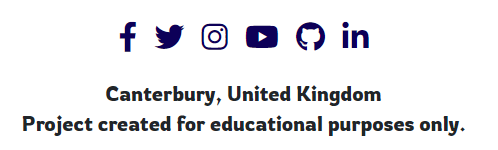

# [**Online Dog Show**](#online-dog-show)
Online dog show is a page where users can post the photo of their dog/s and see other people's photos of dogs. Users can like other posts. Interacting with each other is possible through comments on their posts. There is a little harmless competition between users. The most liked photo is displayed on its own. There is no reward apart from ego boost.


## [Table of content](#table-of-content)
* [User experience](#user-experience)
    * [Site purpose](#site-purpose)
    * [Site goal](#site-goal)
    * [Target audience](#target-audience)
    * [User goals](#user-goals)
    * [Future goals](#future-goals)
* [User stories](#user-stories)
    * [Admin stories](#admin-stories)
    * [User stories](#user-stories)
* [Design](#design)
    * [Wireframe](#wireframe)
    * [Database schema](#database-schema)
    * [Color schema](#color-schema)
    * [Typography](#typography)
    * [Imagery](#imagery)
* [Features](#features)
    * [Existing features](#existing-features)
    * [C.R.U.D.](#crud)
    * [Future features](#future-features)
* [Testing](#testing)
    * [Validator testing](#validator-testing)
    * [Unfixed bugs](#unfixed-bugs)
* [Technologies Used](#technologies-used)
    * [Main Languages Used](#main-languages-used)
    * [Frameworks, Libraries & Programs Used](#frameworks-used)
    * [Installed Packages](#installed-packages)


## **User experience (UX)**<span id="user-experience"><span>
<br>

### **Site purpose**
The intent of the Online Dog Show site is to bring dog owners together. It is a place where they can safely post the photo of their bellowed dog with a short description/story about the photo. Users of the site are able to discuss about the dog breed and anything else relating to dogs. There is a competition on the site in what photo gets most likes.

<br>

### **Site goal**
Site goal is to create a place where dog photos and only dog photos is found. This is to be like a safe haven for dog owners to interact with other dog owners and be able to discuss about the breed. Potentially, users can find from first-hand what certain breed is like.

<br>

### **Target audience**
For every dog lover on the planet. For anyone who would like to find out more about the breed from the owners of that breed. The ideal user age is between 20-60 years of age. 

<br>

### **User goals**
For dog owners to share their best friends with others, even just over the photo and for future dog owners to find out more about the breed they would like to own one day.

<br>

### **Future goals**
* Site to have a filter for users to easily find the breed they are looking for
* Competition to have a reward on weekly basis with a countdown timer
* Each user to have their own profile on the site
* Users to be able to follow other users and see their posted photos
* Ability to sign in with other social media accounts


## **User stories**
Not all stories have been implemented. Some have been left for future implementations as the site grows and expands.


### **Admin stories**
**As an admin:**
1. I can **view and approve entries** so that **content submitted is appropriate** *(story points: 1)*


2. I can **approve comments** so that **the feedback provided is appropriate** *(story points: 1)*


3. I can **create a log in / sign up page** so that **users can sign up to the site** *(story points: 2)*


### **User stories**
**As a user:**
1. I can **easily see what photo has most likes** so that **I can see who is most likely to be a winner** *(story points: 2)*

2. I can **delete my entry** so that **I don't compete in the competition** *(story points: 1)*

3. I can **filter competition page** so that **I can see the photos uploaded in specific order** *(story points: 4)*

4. I can **see competitor's page** so that **I can see all the uploads by them** *(story points: 4)*

5. I can **follow the competitor** so that **I get updated when the submit new photo** *(story points: 4)*

6. I can **edit description I submitted with the photo** so that **I can add more information for others to see** *(story points: 2)*

7. I can **sign up with social media account** so **that sign in is quicker** *(story points: 2)*

8. I can **post comments on the photo** so that **I can tell what I think about the photo** *(story points: 4)*

9. I can **click on the photo** so that **I can see and read more about it** *(story points: 2)*

10. I can **view all entries** so that **I can see who entered the competition** *(story points: 1)*

11. I can **like photos** so that **the photo I liked gets more likes** *(story points: 2)*

12. I can **submit my dog photo** so that **I can be in the competition** *(story points: 2)*

<br>

## **Design**

### **Wireframe**

**Home page:**<br>


<br>

**Competition page:**<br>


<br>

**Entry detail page:**<br>


<br>

**Site navigation:**<br>


### **Database schema**<br>

### **Color palette**<br>


### **Typography**
One font was used through the website. The font is from google fonts:
* Rowdies

### **Imagery**
* Header photo is from [Unsplash](https://unsplash.com/photos/U6nlG0Y5sfs) posted there by [Hannah Lim](https://unsplash.com/@hannah15198)
* Entry photos are from personal collection used for fictional users

<br>

## **Features**

### **Existing features**

**Home Page**<br>


<br>

**Navigation bar**<br>
*Desktop:*<br>


<br>

*Mobile:*<br>


<br>

**Rules Page**<br>


<br>

**All Entries Page**<br>


<br>

**Entry Detail Page**<br>


<br>

**Competition Page**<br>


<br>

**Sign up, Log in and Log out**

*Sign up*<br>


<br>

*Log in*<br>


<br>

*Log out*<br>


<br>

**Social Links**<br>


<br>

### **C.R.U.D.**<span id="crud"><span>
**Create (button)**<br>
* Enter button in navigation bar will bring user to a page with the form to submit their entry
* Enter button is only visible to users that are signed in


<br>

**Create (form)**<br>
* Form is only accessible through <button>Enter</button> button


<br>

**Read**<br>


<br>

**Update and delete**<br>
* The user who directly submitted the entry has an option to edit or delete their entry


<br>

### **Future features**
* Social media sign up
* Filter option in All Entries page
* Each user to have their own profile
* Possibility to follow other users


## **Testing**

1. Navigation bar toggler button have additional border when clicked on:
* fixed by adding css style -> .navbar {--bs-navbar-color: #0d0058;}

<br>

2. Photos not showing on the All Entries page or entry_detail page:
* fixed:
    * misspelled "entry" in {{ entry.featured_image.url }} in All entries template <br>
    * forgot .url in {{ entry.featured_image.url }} in entry_detail page

<br>

3. Slug field not populating by itself when user makes a title input:
 * fixed by importing slugify from django.utils.text and adding "save" method inside class Enter - done as per instruction from StackOverflow (credited in Credits section)

 <br>

4. White space on the right side of the website:
* fixed:
    * footer was missing a parent div with class "container" to div with class "row"

<br>

5. Couldn't render most liked photo on the competition page:
* fixed by the help of stackoverflow comunity who provided whole class that I used to achive that (credited in Credits section)

<br>

6. Form testing: Image required test failed:
* fixed by changing error message from "This field is required." to "No file selected!" as per the error message in terminal

<br>

7. Form testing: test_fields_are_explicit_in_form_metaclass faild:
* fixed by changing the square brackets into parenthesies

<br>

8. Views testing: when checking the response status code to be 200, mine was 301:
* fixed, with the help of previously asked and answered question on StackOverflow, by adding follow=True into the response (credited in Credits section)

<br>

### **Validator testing**

* Html files were passed through the [W3C validator](https://validator.w3.org/) and no html issues were found.

* Errors listed only reference  & {{}} tags.

* CSS files were passed through the [Jigsaw validator](https://jigsaw.w3.org/css-validator/) and no issues were found.


* Page has a 100 Accessibility rating in Lighthouse


* Python files (admin.py, forms.py, models.py, urls.py, views.py, test_forms.py and test_views.py) were passed through [PEP8CI](https://pep8ci.herokuapp.com/) and no issues were found.


* All social links open to external pages as intended.

### **Unfixed bugs**

## **Technologies Used**

### **Main Languages Used**

* HTML5
* CSS3
* Javascript
* Python
* Django
* ElephantSQL

### **Frameworks, Libraries & Programs Used**<span id="frameworks-used"><span>

* GitPod - to create my html files & styling sheet before pushing the project to Github
* GitHub - to store my repository for submission
* Google Fonts - for the font families
* Font Awesome - to add icons to the social links in the footer element
* Django
* Bootstrap
* icons8 - to provide the image for the icon in the tab bar
* LucidChart - to create site navigation diagram

### **Installed Packages**

* 'django<4' gunicorn
* dj_database_url psycopg2
* dj3-cloudinary-storage
* django-summernote
* django-allauth
* django-crispy-forms

## **Deployment**

The site was deployed to Heroku and the steps done to do so are below:

* Install Django & Gunicorn: ```pip3 install 'django<4' gunicorn```
* Install supporting libraries: ```pip3 install dj_database_url==0.5.0 psycopg2```
* Install Cloudinary: ```pip3 install dj3-cloudinary-storage```
* Create the requirements.txt file: ```pip3 freeze --local > requirements.txt```
* Creatre django project using: ```django-admin startproject dogshow .```
* The competition app was then created: ```python3 manage.py startapp competition```
* Add newly installed app to the settings.py file under INSTALLED_APPS
* the changes were then migrated: ```python3 manage.py migrate```
* On the [Heroku](https://dashboard.heroku.com/apps/online-dog-show/), new app was then created with the name "online-dog-show"
* New database was then created with [ElephantSQL](https://customer.elephantsql.com/)
* Back in our workspace, env.py file was created by making sure it is included in .gitignore file too
* In env.py file, DATABASE_URL and SECRET_KEY environment variables were set
* Django project was made aware of env.py file by modifying the settings.py
* Database to be used was changed in settings.py file
* Once again, changes were migrated: ```python manage.py migrate```
* In the Heroku, under settings tab, config vars for DATABASE_URL, SECRET_KEY and PORT
* Account for Cloudinary was created and it's API environment variable was added to the env.py file
* Then new config var for cloudinary was set in our Heroku as well as DISABLE_COLLECTSTATIC=1
* Cloudinary was added to INSTALLED_APPS in settings.py in our workspace
* Code was written to tell Django to use cloudinary to store our media and static files
* Then Code was written to tell Django where our templates will be stored
* Heroku host name was added to ALLOWED_HOSTS in settings.py
* templates and static folders were created
* Procfile was created
* Project was then deploy to Heroku through "deploy" tab using GitHub as deployment method


## **Credits**

* My wife - for the ability to calm me down when struggling with the code.

* "I think therefore I blog" & "Hello Django" - Provided the initial steps for setting up & deploying the site. Credits have been added as comments where code was used.

* [CluelessBiker](https://github.com/CluelessBiker/project4-print-statements#deployment) - for readme template and code to make email field required in the sign up form

* [Stackoverflow](https://stackoverflow.com/questions/50436658/how-to-auto-generate-slug-from-my-album-model-in-django-2-0-4) - for code to auto populate slug field

* [Stacoverflow](https://stackoverflow.com/questions/21215035/django-test-always-returning-301) - to help with testing views code

* [Stacoverflow](https://stackoverflow.com/questions/76284389/django-queryset-first-not-rendering-on-html/76284404?noredirect=1#comment134522675_76284404) - for class code to render most liked photo on the page
